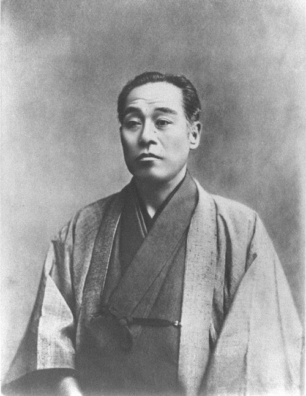
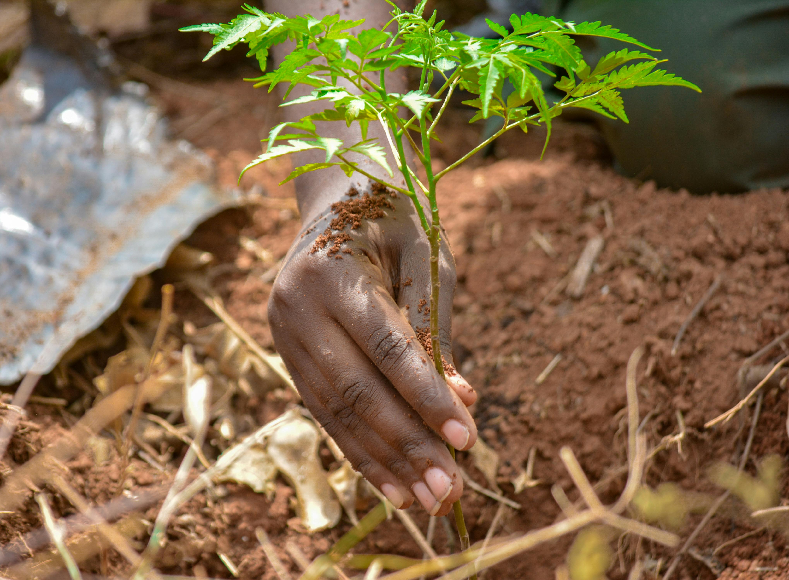

<!-- _class: dark -->

# 大学篇

---

# 教えてください！

<h2>4 年後、大学を出た頃には 何ができると思う？</h2>

---

# ブルガリア人留学生の所感

## 勉強

* 授業は簡単すぎてびっくり
    * 勉強の負荷は海外の大学より軽いかも
* 専門外の授業は面白かった
    * 会計学
    * 電気系
    * ガチ数学
* ぶっちゃけあんま真面目に勉強はしなかった

---

# ブルガリア人留学生の所感

## 学生生活

* 学部 1 〜 3 年までは主にバンドマン
* 学部 4 年は研究を多少頑張った
* 修士 1 〜 2 年は主に ~~酒とタバコ~~ 旅行
* 6 年間ほぼずっとバイトしてた
    * 学部 1 〜 2 年はベンチャーでエンジニア
    * 学部 2 〜 3 年は PA とプログラミング講師を多少
    * 学部 3 〜 修士 2 年は大手 IT 会社でセキュリティ

---

# 卒業してみての感想

## やってよかったこと: レール外れの勉強

* 会計学のおかげでファイナンス界隈へ進出できた（後述）
* 電気系のおかげで IoT を自作できるようになった
* ガチ数学はめちゃめちゃ面白かったし、頭の体操になった

---

# 卒業してみての感想

## やってよかったこと: 実務経験

* エンジニアバイトは実務経験になる
* 実務経験がある人は圧倒的に就職有利
    * 大学の勉強はあくまでも研究のため
    * エンジニア職は職人ゲー
    * 楽器と同じ: 上手くなりたければいっぱい弾くしかない

---

<!-- -class: custom-centered -->

## カネ

---

# 卒業してみての感想

## やってよかったこと: 実務経験

- エンジニアバイトは実務経験になる
- 実務経験がある人は圧倒的に就職有利
    - 大学の勉強は所詮研究のため
    - エンジニアは職人ゲー
    - 楽器と同じ: 上手くなりたければいっぱい弾くしかない
- カネ
    * カネで幸せは買えない
    * しかし道具と経験値は買える

---

# 卒業してみての感想

## やってよかったこと: 冒険

* バイトで稼いだお金の使いみち
    * マイカー
    * マイハープ
    * 全国旅行
    * 旅先での片思い

---

# 卒業してみての感想

## やってよかったこと: 冒険

- バイトで稼いだお金の使いみち
    - マイカー
    - マイハープ
    - 全国旅行
    - ~~旅先での片思い~~
    - 旅先での片思いが実らなかったことを嘆くための酒とタバコ

---

# 卒業してみての感想

## やってよかったこと: 冒険

- バイトで稼いだお金の使いみち
    - マイカー
    - マイハープ
    - 全国旅行
    - ~~旅先での片思い~~
    - ~~旅先での片思いが実らなかったことを嘆くための酒とタバコ~~
    - 色んなところでの友達作り

---

# 当時の自分に言いたいこと

* 3 杯に 1 杯はソフドリにした方が良いよ
* タバコは思ってる以上に臭いよ
* 深夜のジンより早朝のコーヒーの方が意外と美味いよ
* 毎朝 15 分だけ掃除すれば部屋が綺麗になるよ
* 仕事の話を技術ブログに書いた方がいいよ
* 夜中にサビ残するより友達とダベった方がいいよ
* 宿の店員さんが LINE でハートを送ってくれるのは営業だよ 🥰
* 世の中の大人は意外とポンコツだよ
* 大学生はたいていクソガキだよ
* お前もな

---

## 無事生き残れて 良かったね！

無事とは？

---

# 今の皆さんに言いたいこと

* 大学にいる間に苦労しておいた方が良い
* 苦労は投資と同じ

1. まずは収支を黒字にする
2. 次に緊急用の貯金を作る
3. 以降余った分は全部投資

1) 日頃から無理するのを辞める
2) 辛いときに助けてくれる人を作る
3) 敢えて苦手なことをしてみる

* 残念ながら苦労する気力にも貧富の格差はある
    * 人間関係に恵まれた人もいれば、そうでない人もいる

---

<a href="https://www.pexels.com/photo/hand-planting-a-tree-seedling-in-uganda-35744764/" style="font-size: .5em">https://www.pexels.com/photo/hand-planting-a-tree-seedling-in-uganda-35744764/</a>

The best time to plant a tree was 30 years ago. The second best time is  **now.** 

---
